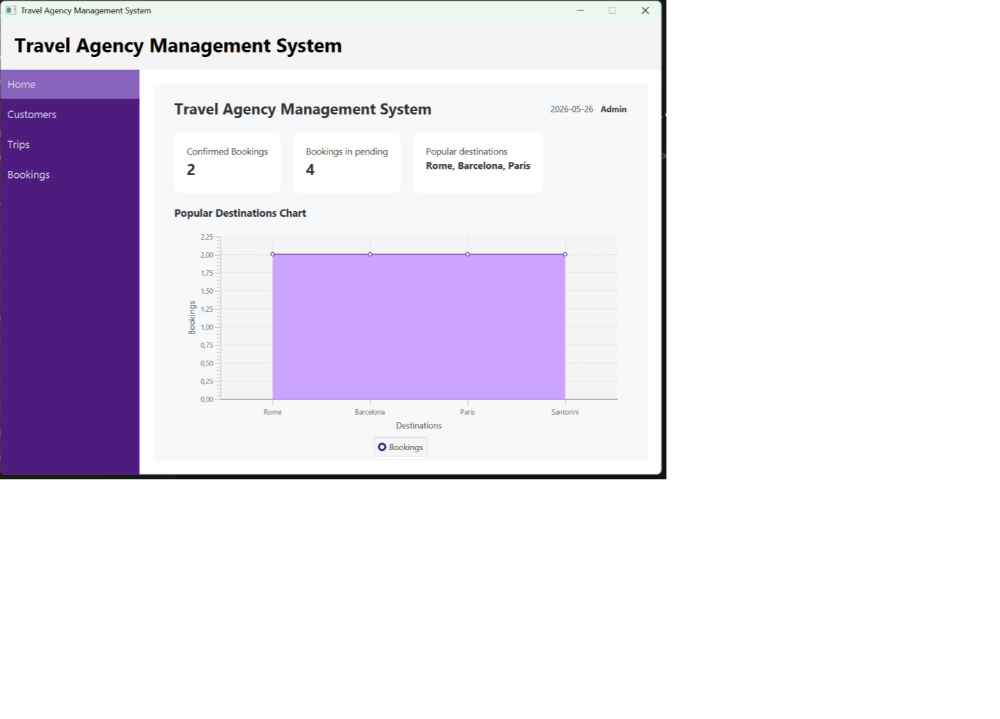
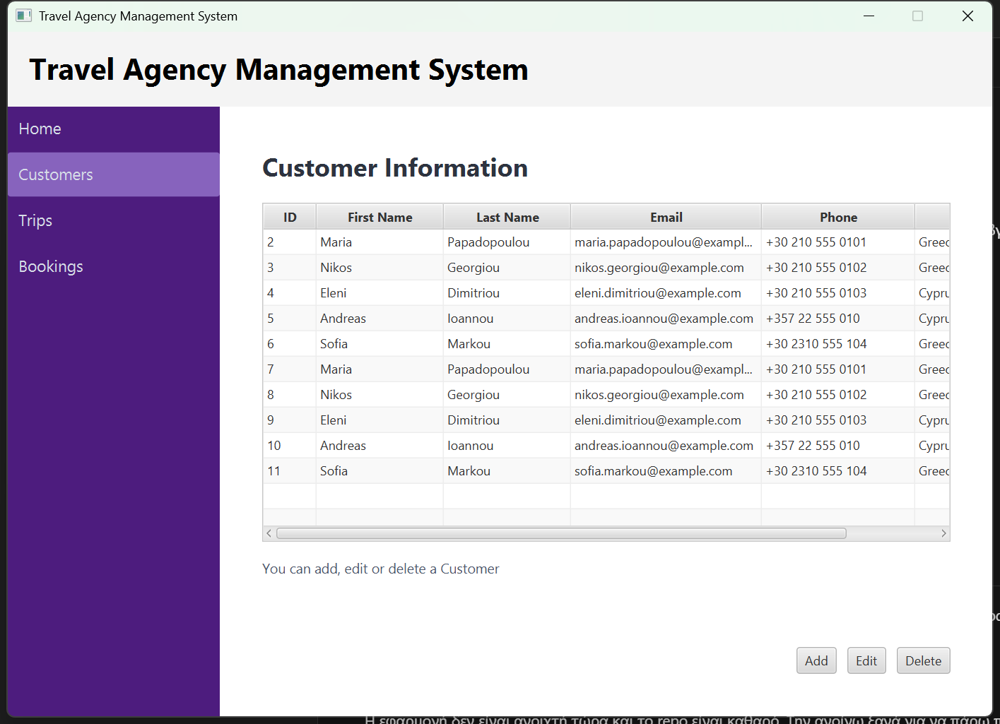
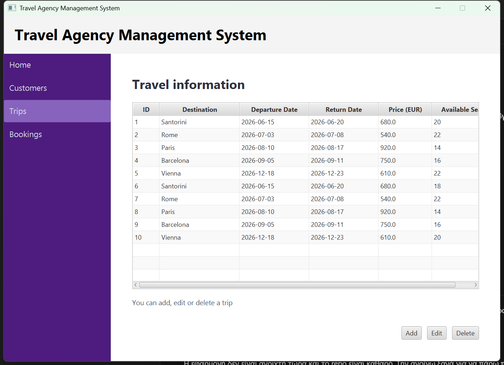
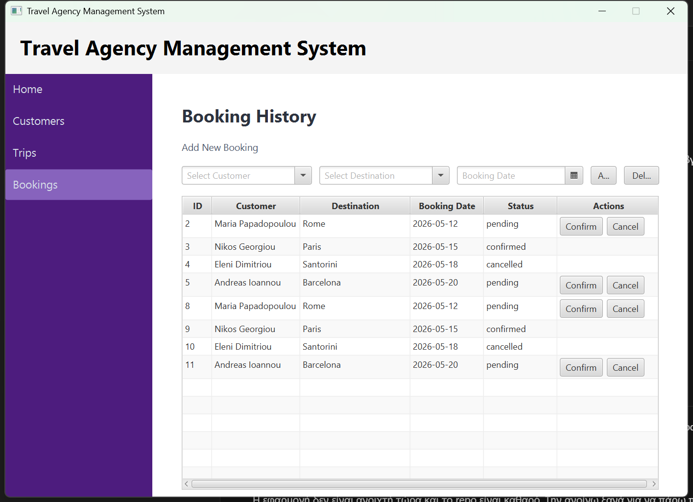

# Travel Agency Management System

A JavaFX desktop application for managing a small travel agency. The app provides customer, trip, and booking management with a MariaDB/MySQL database backend.

## Features

- Dashboard with booking statistics and popular destination chart
- Customer management: add, edit, delete, and view customers
- Trip management: add, edit, delete, and view travel packages
- Booking management with customer and destination selection
- Booking status workflow: pending, confirmed, and cancelled
- Seat availability checks before confirming bookings
- Automatic seat updates when confirmed bookings are cancelled or deleted
- Input validation for customer details, trip dates, prices, seats, and booking dates
- Database connection configurable through environment variables or Java system properties

## Tech Stack

- Java 21
- JavaFX 23
- FXML
- Maven
- MariaDB/MySQL
- JDBC

## Project Structure

```text
.
+-- database/
|   +-- schema.sql
+-- src/main/java/com/verav/travelagency/
|   +-- App.java
|   +-- controller/
|   +-- model/
|   +-- services/
|   +-- common/
+-- src/main/resources/com/verav/travelagency/
|   +-- css/
|   +-- fonts/
|   +-- view/
+-- DATABASE_SETUP.md
+-- pom.xml
+-- README.md
```

## Database Setup

This project uses MariaDB/MySQL.

1. Create the database and tables by running:

```bash
mysql -u root -p < database/schema.sql
```

Optional: add demo data for local testing and screenshots:

```bash
mysql -u root -p < database/seed.sql
```

2. Configure the database connection.

The app reads these values from environment variables:

```text
DB_URL=jdbc:mariadb://localhost:3306/agency_db
DB_USER=root
DB_PASSWORD=your_password
```

If no values are provided, the default configuration is:

```text
DB_URL=jdbc:mariadb://localhost:3306/agency_db
DB_USER=root
DB_PASSWORD=
```

You can also pass the configuration as Java system properties when running the app.

## Run Locally

Prerequisites:

- Java 21 or newer
- MariaDB/MySQL server
- Maven or the Maven wrapper included in the project

Run with the Maven wrapper on Windows:

```bash
mvnw.cmd javafx:run
```

Run with the Maven wrapper on macOS/Linux:

```bash
./mvnw javafx:run
```

Run with custom database credentials:

```bash
mvnw.cmd javafx:run -DDB_URL=jdbc:mariadb://localhost:3306/agency_db -DDB_USER=root -DDB_PASSWORD=your_password
```

## Main Screens

- **Home Dashboard**: displays booking totals and popular destinations.
- **Customers**: manages customer records.
- **Trips**: manages travel packages, prices, dates, and available seats.
- **Bookings**: creates bookings, confirms or cancels them, and updates seat availability.

## Screenshots






## Notes

- The database schema is available in `database/schema.sql`.
- Extra database instructions are available in `DATABASE_SETUP.md`.
- Build output such as `target/` should not be committed.
- The repository includes GitHub Actions CI that runs the Maven test suite on pushes and pull requests.
- Keep local IDE files, generated Maven output, and modernization logs out of commits.

## Future Improvements

- Add integration tests for booking seat updates with a test database
- Add a short demo video for portfolio presentation
- Add richer error handling for database connection failures
